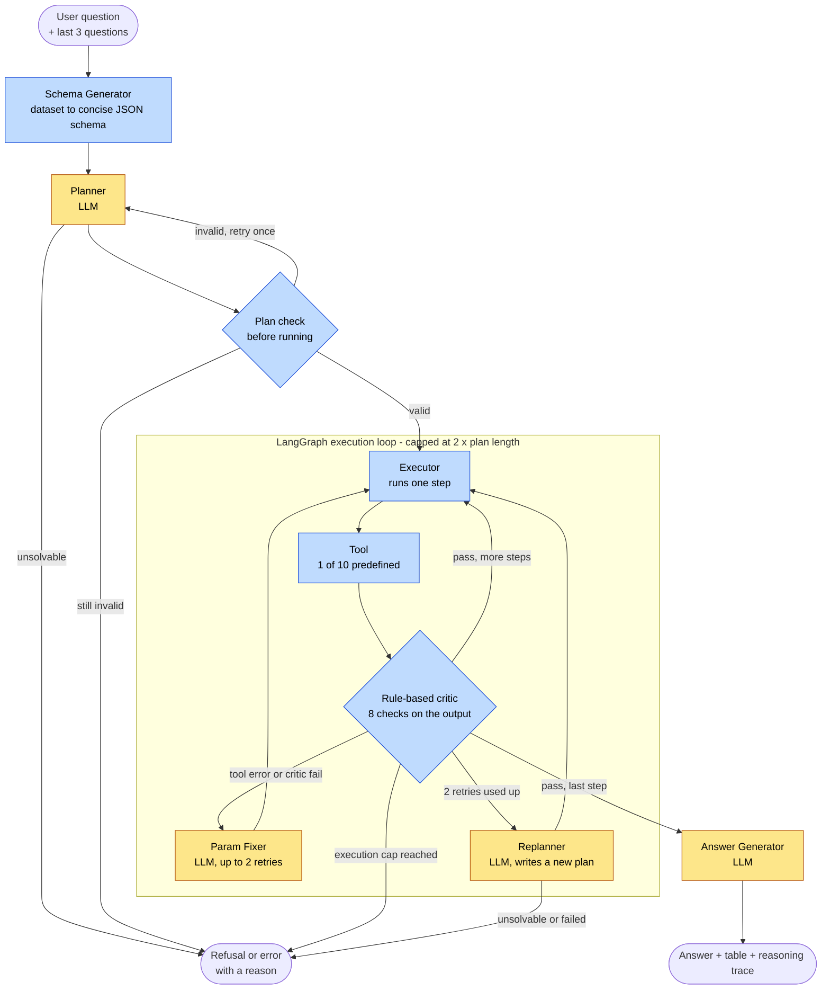

# Autonomous Data Analysis Agent (ADAA)

[](https://github.com/Shriram016/Autonomous-Data-Analysis-Agent/actions/workflows/ci.yml)

**Ask a data question in plain English and get a computed answer you can trace.**

Most "chat with your data" tools let an LLM write code and run it. ADAA works differently. The LLM only writes a *plan*, a short list of steps, and ten predefined, tested tools do the computing. Every step is checked, every answer comes with its reasoning trace, and the system can refuse a question it cannot answer instead of guessing.

**Why this project exists:** to measure honestly how far an LLM can be trusted with data when it is not allowed to run its own code. This repo contains the agent, its evaluation, and a head-to-head comparison with the "let the LLM write the code" approach.

**At a glance:** Sample Superstore dataset (9,994 rows) · 10 fixed tools · one model (`gpt-oss-20b` on Groq) for every LLM step · evaluated on 63 questions · about $0.0005 and 4 seconds per question.

**Live demo:** [autonomous-data-analysis-agent-s16.streamlit.app](https://autonomous-data-analysis-agent-s16.streamlit.app/)

---

## What It Does

- **Answers questions about a dataset in plain English**, for example "Which are the top 5 states by total sales?"
- **Plans, then computes.** The LLM writes a short plan, and predefined tools run it step by step. The LLM never writes or runs code.
- **Checks every step.** A rule-based critic validates each tool's output, and failed steps go to an LLM-powered fixer or a replanner.
- **Shows its work.** You get the computed table, a plain English summary and the full reasoning trace.
- **Handles follow-ups.** It remembers the last 3 questions in a session, so "What about 2015?" resolves from context.
- **Refuses what it cannot answer.** For a question it cannot answer with its tools, it says so instead of guessing.

### Example

**Question:** "Which are the top 5 states by total sales?"

**Plan the LLM writes (3 steps, all checked):**
1. `groupby_aggregate`: sum `Sales` per `State`
2. `sort`: by `Sales_sum`, descending
3. `top_n`: keep 5 rows

**Answer:** California $457,687.63, New York $310,876.27, Texas $170,188.05, Washington $138,641.27, Pennsylvania $116,511.91. It took about 2.5 seconds and cost about $0.0003.

---

## Architecture



Yellow boxes are LLM steps, blue boxes are plain code.

**Who does what.** Four jobs use the LLM (the planner, param fixer, replanner and answer generator, all `gpt-oss-20b`). Everything else is plain code: the schema generator, the plan check, the ten tools, the critic and the graph.

**Where the checks sit.** The plan is checked before anything runs (known tools, correct parameters, steps in order, each step reading the previous step's output). Each tool's output is checked right after it runs, and the critic runs even when the tool itself errored. The critic checks *structure* (an empty table, missing columns, a wrong row count), not *meaning*. What it cannot catch is covered under Known Limitations.

**When something goes wrong.** A tool error or a critic failure sends the step to the param fixer (up to 2 attempts), then to the replanner for a new plan. If the execution cap is reached, or the replanner cannot produce a valid plan, the run ends with an error message. If the answer LLM fails, a plain answer is built directly from the result table, so the table is always returned.

---

## Eval Results

> **48 of 63 correct (76%)** · **$0.029** for the whole run · about $0.0005 and 4 seconds per question
>
> 63 questions on Sample Superstore, one full run. Every answer is checked against ground truth computed independently with pandas.

### Scoreboard

| Question type | Correct | |
|---|---|---|
| Single-turn questions (37) | **33 / 37** · 89% | █████████░ |
| Multi-turn follow-ups (16) | **10 / 16** · 63% | ██████░░░░ |
| Compound questions that should be refused (10) | **5 / 10** · 50% | █████░░░░░ |

### What works and what struggles

✅ **Works well:** simple aggregation, grouping and ranking, time-based, multi-condition and derived questions (25 of 25).

⚠️ **Struggles with:** filtering (3 of 5, it sometimes drops the filter), follow-ups that depend on 4 turns (1 of 4), and knowing when to refuse (5 of 10).

### Why the 15 failures happened

| Cause | Cases | |
|---|---|---|
| Answered a question that should have been refused | 5 | █████ |
| Dropped a filter and returned the whole-dataset total | 4 | ████ |
| Refused a question that was answerable | 2 | ██ |
| Ignored or misused earlier turns | 2 | ██ |
| Wrong step order | 1 | █ |
| Returned extra rows | 1 | █ |

> [!IMPORTANT]
> **The rule-based critic caught none of these 15.** Almost every failure is about *meaning* (what to filter, whether to answer), and the critic only checks structure. That gap is the main lesson of the evaluation.

**How steady is it?** We re-ran 20 questions 3 times each: the plan was identical across runs for 78% of questions, so treat any single run's numbers as approximate.

<details>
<summary>Fine print: all categories and notes</summary>

| Category | Correct |
|---|---|
| Simple aggregation / Grouping and ranking / Time-based / Multi-condition / Derived (5 each) | 5/5 each |
| Filtering | 3/5 |
| "Total plus breakdown" and comparison | 5/7 |
| Multi-turn, 2 / 3 / 4 turns | 4/6 · 5/6 · 1/4 |

- One run, so small differences are noise.
- Counting an answer as correct when it contains all expected rows plus extras (used in the comparison below) gives 49/63.
- Two answers had a wrong number in the summary sentence (off by $1 and by 2 cents).
- Full results: [comparison workbook](llm_codegen_experiment/results/comparison_adaa_vs_llm.xlsx) and `eval/results/full_2026_10_06_23_35_25/`.
- The earlier figures (29/30 and 12/16) came from separate runs with a different answer model.

</details>

---

## Why Not Just Let the LLM Write the Code?

We tried it. A baseline asks the same model (`gpt-oss-20b`) to write pandas code, runs it in a restricted sandbox, and answers the same 63 questions.

**Pros**
- The code-writing approach was about as accurate as ADAA on our 63 questions (49 correct for both, counting an answer as correct when it contains all the expected rows even if it adds extras), although with one run each the small gaps are within noise.
- It never dropped a filter, which was the most common failure in ADAA.
- It was about 3.5 times cheaper and 1.7 times faster ($0.00013 versus $0.00046 per query).
- It is flexible, because it can answer multi-part questions that ADAA's tools cannot return as a single table.

**Cons**
- It can give wrong answers without any error, for example when outdated pandas syntax made it pick the wrong month.
- It can crash on a wrong operation, such as a misplaced `int()`, and our baseline had no retry to recover.
- It can lose context in follow-up questions, as when it kept the old metric after the user had switched to a new one.
- It needs a sandbox to run LLM-written code, and ours is only a restricted `exec` with a blocklist, which is fine for an experiment but not safe for untrusted users and once blocked a legitimate `df.query()`.
- It gives you no plan to inspect and no step-by-step checks, so a wrong answer is harder to trace.

**What we decided:** ADAA stays. Not because it is more accurate (on this data it is not), but because fixed tools can only do what we allow, every step is visible and checked, and it refuses what it cannot do. For a trusted analyst on clean data, direct code generation with a sandbox and a retry is a reasonable choice. Caveat: one run each on a clean dataset; messier data (V3) may favour fixed tools more. Details: [docs/v2-polish-plan.md](docs/v2-polish-plan.md) (Part D).

---

## Known Limitations

| | Limitation | In practice |
|---|---|---|
| 🧠 | **The critic checks structure, not meaning** | It caught 0 of the 15 failures. A wrong filter still looks like a valid table. |
| 🎲 | **The planner isn't fully repeatable** | It sometimes drops a filter or misreads a follow-up (6 of 15 failures). The same question can produce a different plan. |
| 🔀 | **One answer can't hold two results** | "Total sales *and* total profit" is refused. It got 5 of 10 compound questions right. |
| 🧵 | **Short memory** | It keeps the last 3 questions only. 4-turn follow-ups were right in 1 of 4 cases. |
| 📊 | **Small, clean dataset** | One table, 63 questions, one run. Messy multi-table data is the goal of V3. |
| ✍️ | **The summary sentence is written by an LLM** | The table is the source of truth. 2 of 53 sentences had a small number slip. |
| 🔌 | **One provider, one model** | Everything runs on `gpt-oss-20b` through Groq, with no fallback if a model is deprecated. |
| 🧪 | **A demo, not a hardened service** | No login, rate limiting or multi-user handling. |

Next: [V3](docs/v3-problem-statement.md) targets real multi-table data, semantic checks for these failures, and a production-style design.

---

## Key Features

| Feature | What it gives you |
|---|---|
| **LangGraph pipeline** | Typed state, conditional routing, and retries and replanning as graph nodes. |
| **Fixed tool layer** | 10 predefined, tested tools. The LLM picks the tools and parameters but never writes code. |
| **Two layers of checking** | The plan is validated before anything runs, and each tool's output is checked by 8 rules right after it runs. |
| **Session memory** | The last 3 questions of a session, so follow-ups like "What about 2015?" work. |
| **Langfuse tracing** | Every LLM call is traced with its prompt, response, token usage and latency. |
| **Streamlit chat UI** | A chat interface with history and session management (see the live demo). |
| **Reproducible evaluation** | 63 questions with independent pandas ground truth. One command runs everything, saves results as it goes, and records which code and model produced them. |
| **Offline tests and CI** | 290+ tests that need no API key, run on every push. |

---

## Tech Stack

| Component | Technology | Used for |
|---|---|---|
| Language | Python 3.11+ | Everything (developed on 3.13) |
| Data | Pandas | The 10 tools and the ground-truth checks |
| LLM | Groq API, `openai/gpt-oss-20b` | Planner, param fixer, replanner and answer generator |
| Orchestration | LangGraph | Pipeline state, routing, retries and replanning |
| Validation | Pydantic | Checking the LLM's plan structure |
| Observability | Langfuse | Tracing every LLM call |
| UI | Streamlit | The chat interface and live demo |
| Testing | pytest, GitHub Actions | Offline tests on every push |

**One model for every LLM step.** All four jobs use `gpt-oss-20b` on Groq: the original answer model was deprecated, and the alternatives were Preview-only or twice the price. Each job still has its own setting in `src/config.py`, so a swap is a config change.

---

## Getting Started

**Prerequisites:** Python 3.11+ (developed on 3.13), a [Groq API key](https://console.groq.com/), and optionally a [Langfuse account](https://langfuse.com/) for tracing.

### 1. Set up and run the app

```bash
git clone https://github.com/Shriram016/Autonomous-Data-Analysis-Agent.git
cd Autonomous-Data-Analysis-Agent

python -m venv agent_env
agent_env\Scripts\activate          # macOS/Linux: source agent_env/bin/activate
pip install -r requirements.txt

cp .env.example .env                # then add your keys (Windows: copy .env.example .env)
streamlit run app.py
```

### 2. Run the tests (offline, no API key, free)

```bash
pip install -r requirements-dev.txt
python -m pytest tests llm_codegen_experiment/tests
```

### 3. Run the evaluation (calls the LLM)

```bash
python eval/run_full_eval.py --dry-run   # checks everything first, no LLM calls, no cost
python eval/run_full_eval.py             # all 63 questions, about $0.03 and 5 minutes; asks to confirm
```

Results are saved in `eval/results/full_<timestamp>/`. If a run stops, continue it with `--resume <folder>`.

### 4. Reproduce the "LLM writes the code" comparison

```bash
python llm_codegen_experiment/run_experiment.py --repeats 1   # about $0.008 and 3 minutes
python llm_codegen_experiment/compare.py                      # builds the Excel comparison, offline and free
```

---

## Documentation

**How it works**
- [Architecture](docs/architecture.md): pipeline flow, components, state, design decisions, and the model audit
- [Tools](docs/tools.md): all 10 tools with parameters, examples and ordering rules
- [Groq model notes](docs/others/groq-model-details.md): the models available, prices, limits and why we use one

**Evaluation**
- [Evaluation report](docs/evaluation.md) and [cumulative eval report](docs/eval_report_final.md): earlier eval rounds with per-query analysis (they predate the 63-question baseline run above)
- [Failure modes](docs/failure-modes.md): handled failures, known limitations and the retry flow
- [V2 polish plan](docs/v2-polish-plan.md): the full record of the V2 evaluation work: instrumentation, the failure-cause breakdown, the code-generation comparison, and every decision with its evidence
- [Comparison workbook](llm_codegen_experiment/results/comparison_adaa_vs_llm.xlsx): the 63-row ADAA vs code-generation table

**Plans**
- [V2 plan](docs/v2-plan.md): the V2 upgrade scope (LangGraph, session memory, Langfuse)
- [V3 problem statement](docs/v3-problem-statement.md) and [V3 requirements](docs/v3-requirements.md): the next version

---

## V1 → V2 Evolution

V1 was built from scratch with raw Python orchestration: manual loop control, dict-based state, and stub implementations for error recovery. It validated the core idea: an LLM plans, predefined tools execute, a rule-based critic validates.

V2 addressed the gaps that V1 exposed:

| What changed | V1 | V2 |
|---|---|---|
| Orchestration | Manual Python loops | LangGraph with conditional edges |
| State management | Raw dicts passed between functions | Structured `PipelineState` TypedDict |
| Error recovery | Param Fixer and Replanner were stubs | Real LLM-powered nodes that correct parameters and generate new plans |
| Session memory | None, each query was independent | Sliding window of the last 3 questions enables multi-turn follow-ups |
| Observability | File logging only | Langfuse tracing on every LLM call (prompt, response, tokens, latency) |
| UI | Single-turn form with one result displayed | Conversation-style chat with history |
| Model | `llama-3.1-8b-instant` | `gpt-oss-20b` for every LLM job |
| Evaluation | 30 single-turn queries, pass or fail | 63 questions (single-turn, compound, multi-turn) with ground truth, a failure-cause breakdown, a consistency test and a head-to-head with LLM-written code |
| What an eval run records | Pass or fail and retry counts | The plan, which critic check fired, fixer and replanner events, tokens, cost and latency per call, and a check on every number in the answer |
| Tests | One end-to-end script and one unit-test file | 290+ offline tests and CI on every push |
