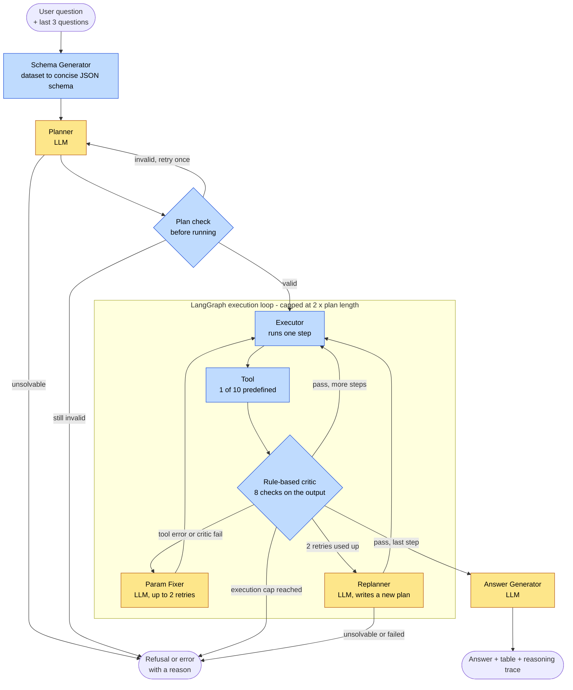

# Architecture — Autonomous Data Analysis Agent (ADAA)

## Pipeline Overview



Yellow boxes are LLM steps, blue boxes are plain code. The diagram is the same one used in the README and matches the routing in `src/core/graph.py`.

The pipeline is orchestrated by **LangGraph** with structured state management. Each component is a graph node connected by conditional edges that handle step progression, retries, and replanning.

---

## Components

### Schema Generator
- **Input:** Raw DataFrame (9,994 rows × 21 columns)
- **Output:** Condensed JSON schema with per-column dtype, stats (min/max/median for numeric), sample values for categorical columns, date ranges for datetime
- **Why:** The LLM cannot receive the raw dataset — only the schema is passed to the Planner

```json
{
  "Order Date": {"dtype": "datetime64[ns]", "min": "2021-01-01", "max": "2024-12-31"},
  "Category":   {"dtype": "object", "unique_count": 3, "sample_values": ["Furniture", "Technology", "Office Supplies"]},
  "Sales":      {"dtype": "float64", "min": 0.44, "max": 22638.48, "median": 54.49}
}
```

---

### Planner (LLM)
- **Model:** `openai/gpt-oss-20b` via Groq API — temperature 0.0, reasoning model with `reasoning_effort: low`
- **Input:** User query + condensed schema + previous questions (if multi-turn session)
- **Output:** `{"status": "success", "plan": [...]}` or `{"status": "unsolvable", "reason": "..."}`
- **Validation:** Two layers — Pydantic models for structure + `_validate_plan()` for business logic (tool names, parameter signatures via `inspect`, sequential steps, state store chaining, mutual exclusion of `aggregate_column` and `groupby_aggregate`)
- **Retry:** Re-calls LLM once with the validation error injected if the plan fails checks

**Example plan — "Top 10 customers by sales in last 3 months":**
```json
[
  {"step": 1, "tool": "date_filter",       "parameters": {"col_name": "Order Date", "time_period": "3M", "end_date": "2024-12-31"}, "input": "original_df",    "output": "step_1_output"},
  {"step": 2, "tool": "groupby_aggregate", "parameters": {"group_col": "Customer Name", "agg_col": {"Sales": "sum"}},               "input": "step_1_output", "output": "step_2_output"},
  {"step": 3, "tool": "sort",              "parameters": {"sort_col": {"Sales_sum": "desc"}},                                        "input": "step_2_output", "output": "step_3_output"},
  {"step": 4, "tool": "top_n",             "parameters": {"N": 10},                                                                  "input": "step_3_output", "output": "step_4_output"}
]
```

---

### Tool Layer
10 predefined functions. The LLM selects tools and specifies parameters — it never generates free-form code.

| Tool | Purpose |
|---|---|
| `date_filter` | Filter rows within a lookback date range |
| `filter_by_condition` | Filter rows by a single column value (`==`, `!=`, `>`, `>=`, `<`, `<=`) |
| `extract_date_part` | Extract month / year / quarter / day into a new column |
| `column_arithmetic` | Arithmetic between two columns; supports datetime subtraction (result = days) |
| `groupby_aggregate` | Group by one or more columns and aggregate (sum, mean, count, min, max, median, std) |
| `aggregate_column` | Single aggregate over the whole dataset — no grouping; returns 1-row result |
| `sort` | Sort by one or more columns (ascending or descending) |
| `top_n` | Return the first N rows (always preceded by sort) |
| `select_columns` | Keep only specified columns, drop the rest |
| `rename_column` | Rename columns via a mapping |

---

### Executor + State Store
- Reads each step from the plan, calls the correct tool, and manages intermediate outputs in a state store
- **State store:** `{"original_df": df, "step_1_output": df, ...}` — each step reads from the previous step's output
- A failed step is never skipped — downstream steps depend on its output
- Partial trace returned on failure — all records up to the failure point are included

---

### Rule-Based Critic
Runs after every tool call and checks the tool's **output**. The plan itself is checked earlier, before anything runs, by Pydantic and `_validate_plan()`. The critic also runs when the tool itself errors. Deterministic, no LLM — fast and cheap. The first failing check short-circuits the rest. It checks structure, not meaning: in the 63-question baseline run it caught none of the 15 failures (see [failure-modes.md](failure-modes.md)).

| Check | What It Catches |
|---|---|
| Result is not None | Silent tool crash |
| Result is not empty | Over-filtering removed all rows |
| No fully empty columns | Key columns have no data |
| Expected columns present | Wrong or dropped column names |
| groupby row count = unique group values | Aggregation correctness |
| top_n rows ≤ N | top_n working correctly |
| Date filter within specified range | date_filter correctness |
| Aggregated columns are numeric | Type integrity after groupby |

---

### Param Fixer (LLM)
- **Model:** `openai/gpt-oss-20b` via Groq API — temperature 0.0
- **Triggered:** When a step fails critic checks and retries are available (max 2 retries per step)
- **Input:** Failed step, error message, critic check name, original query, schema
- **Output:** Corrected parameters for the failed step
- The executor re-runs the step with the corrected parameters

---

### Replanner (LLM)
- **Model:** `openai/gpt-oss-20b` via Groq API — temperature 0.0
- **Triggered:** When all retries for a step are exhausted (max 1 replan attempt)
- **Input:** Original query, schema, failed plan, error history
- **Output:** A completely new execution plan starting from `original_df`
- Execution restarts from step 1 of the new plan

---

### LangGraph Execution Loop
Replaces the V1 manual loop controller. Retry and replan logic is implemented as conditional edges in the graph.

```
schema_gen → planner → execute_step
                            |
              (conditional edge after execute_step)
              ├── success + more steps     → execute_step (loop back)
              ├── success + last step      → answer_gen
              ├── fail + retries left      → param_fixer → execute_step
              ├── fail + retries exhausted → replanner
              └── execution cap hit        → END (error)

replanner → (conditional edge)
              ├── success → execute_step (restart with new plan)
              └── fail    → END (error)
```

**Limits:**
- Per-step retry limit: 2 (3 total attempts per step)
- Max replan attempts: 1
- Total execution cap: `len(plan) × 2`

---

### Answer Generator (LLM)
- **Model:** `openai/gpt-oss-20b` via Groq API — temperature 0.3, `reasoning_effort: low`, `max_tokens` 1024 (reasoning tokens count toward the cap). Replaced `llama-3.1-8b-instant`, which Groq deprecated; one model now serves every LLM job (see the README for why)
- **Input:** User query + final computed DataFrame
- **Output:** Plain English summary of the result (2-3 sentences)
- Runs once after the execution loop completes — outside the retry loop
- Failure is non-critical: pipeline returns the DataFrame plus a deterministic fallback answer (an empty LLM answer counts as a failure and is flagged in the eval record as `answer_is_fallback`)

**Known limitation:** The answer generator can hallucinate arithmetic when summarizing multi-row DataFrames. It should not be relied upon to sum, re-aggregate, or derive values from the data — it is only reliable when restating values already present in the result.

---

### Session Memory
- Stores the last 3 user questions per session in the LangGraph state (`recent_questions` field)
- Previous questions are passed to the Planner so follow-up queries like "What about 2015?" can resolve context from prior turns
- Session state persists across turns via LangGraph's SQLite checkpointer keyed by `session_id`
- Each query still runs on `original_df` from scratch — no result reuse across turns

---

### Observability

**File logging:**
- One log file per run: `logs/run_YYYY_MM_DD_HH_MM_SS.log`
- Unique `run_id` links every event for a query
- Console handler (INFO) + file handler (DEBUG)

**Langfuse tracing:**
- Every LLM call (Planner, Param Fixer, Replanner, Answer Generator) is instrumented as a Langfuse generation
- Captures: prompt, response, model name, token usage, latency
- Traces are linked by `run_id` and grouped by `session_id`

---

### Streamlit UI
Conversation-style chat interface using Streamlit's native chat elements (`st.chat_message`, `st.chat_input`).

- Chat history displayed oldest → newest in a scrollable container
- Each turn shows the user's question and the assistant's plain English answer
- Detailed view (result table, execution trace, plan steps) rendered for the latest turn only
- Sidebar: session info (session ID, recent questions) and "New Session" button

---

## Pipeline State

All components share a single typed state object (`PipelineState`) passed through the LangGraph graph:

```python
class PipelineState(TypedDict):
    # Inputs
    query: str
    run_id: str
    session_id: str
    original_df: pd.DataFrame
    recent_questions: list[str]

    # Schema Gen output
    schema: Optional[dict]

    # Planner output
    plan: list[PlanStep]
    max_executions: int

    # Execution state
    state_store: dict[str, pd.DataFrame]
    current_step_index: int
    retry_count: int
    total_executions: int
    trace: list[dict]

    # Final outputs
    final_df: Optional[pd.DataFrame]
    status: str
    message: str
    answer: Optional[str]
```

---

## Model Audit (checked 2026-10-06)

V2 is Groq-only and runs one model, `openai/gpt-oss-20b`, for every LLM job.

| Job | Model | Settings | Tokens per call (in / out) | Why |
|---|---|---|---|---|
| Planner | `openai/gpt-oss-20b` | temp 0, low reasoning, JSON mode | ~2,690 / ~70-230 (measured) | Follows the strict tool/JSON rules; locked for the baseline |
| Param Fixer | `openai/gpt-oss-20b` | same | ~1,100 / ~100-300 (estimate) | Same family as the planner |
| Replanner | `openai/gpt-oss-20b` | same | ~2,800 / ~100-400 (estimate) | Reuses the planner's plan format |
| Answer Generator | `openai/gpt-oss-20b` | temp 0.3, low reasoning, `max_tokens` 1024 | ~280 / ~75 (measured) | Groq's recommended replacement for the deprecated `llama-3.1-8b-instant` |

**Price:** `gpt-oss-20b` costs $0.075 input / $0.30 output per 1M tokens. A typical query costs about $0.0003.

**Alternatives considered**
- `openai/gpt-oss-120b` ($0.15 / $0.60): twice the price with no measured benefit.
- `qwen/qwen3.8-27b` ($0.80 / $4.00): Preview status, so it can be discontinued at short notice.
- `llama-3.1-8b-instant`, `llama-3.3-70b-versatile`: deprecated or enterprise-only; return 404 on the key (this is why the answer generator moved).
- `allam-2-7b`: undocumented by Groq. The remaining models on the key are speech or safety models, not text writers.

**Rate limits:** the planner uses about 2,700 tokens per query, so the account's tokens-per-minute limit sets how fast evals can run (8,000 tokens/min on the key when tested, versus 250K on Groq's paid Developer plan).

**Known limitation:** all jobs share one model, so a single deprecation or outage breaks all four. A provider-agnostic LLM layer with fallbacks is a V3 item (see `docs/v3-problem-statement.md`, checklist row 10).

Full catalog and the data behind this table: [others/groq-model-details.md](others/groq-model-details.md).

---

## Key Design Decisions

| Decision | Choice | Reason |
|---|---|---|
| Free code gen vs predefined tools | Predefined tools | Safe, validatable, debuggable — no black box. Measured: LLM-written code was about as accurate and about 3.5× cheaper; fixed tools win on safety, traceability and refusals (see the README) |
| Critic type | Rule-based only (deterministic) | Deterministic and free. It checks structure only and caught none of the 15 failures in the 63-question run, so semantic checking is an open gap (V3). An LLM critic was not tested |
| State store | Dict keyed by step output name | Enables retry from the failure point, not from scratch |
| Retry limits | 2 retries per step, then a replan; total step runs capped at 2 × the plan length | Prevents infinite loops while allowing self-correction (replans are limited only by the cap) |
| Schema passed to Planner | Condensed (dtype + min/max + sample values) | Fewer tokens; model handles narrow structured tasks better |
| groupby + aggregate | Single combined tool | `groupby` alone returns an unusable GroupBy object, never a DataFrame |
| Answer Generator failure | Non-critical — pipeline returns DataFrame regardless | Narration is supplementary; computed data is the primary output |
| Session memory scope | Questions only — not answers or DataFrames | Each query runs on original_df from scratch; no result reuse |
| Orchestration framework | LangGraph | Conditional edges replace manual loop logic; structured state replaces raw dicts |
